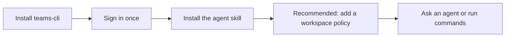

# teams-cli

A command-line client that gives people and compatible coding agents access to Microsoft Teams through a persistent local browser session.

> [!WARNING]
> This project relies on undocumented Microsoft Teams behavior and a Microsoft first-party client identity. It is unsupported, may be blocked by tenant policy, and may stop working without notice. Obtain organizational approval before using it, and never run live write tests against a production tenant.

## Quick start

You need Node.js 22.20 or newer, Microsoft Edge or Google Chrome, and a Microsoft 365 account with Teams access. Node.js 24 LTS is recommended. See the [installation guide](docs/use/installation.md) for operating-system-specific setup and troubleshooting.

### 1. Install the CLI

```bash
npm install --global @michaelschnyder/teams-cli
teams-cli --version
```

### 2. Sign in

```bash
teams-cli login
```

`teams-cli login` is the convenient alias for `teams-cli auth login`. It opens a dedicated Microsoft Edge profile by default, or a dedicated Google Chrome profile when selected. It does not reuse your normal browser profile or its signed-in session. The CLI discovers the Teams tenant and user, then saves them in the implicit `default` profile. Most users never need to provide a tenant ID or create a named profile.

### 3. Install the agent skill

```bash
teams-cli skills install
```

The packaged `teams-cli` skill teaches compatible coding agents how to authenticate, discover Teams resources, read and send messages, and respect policies. Auto-detection supports Codex, Claude Code, Cursor, GitHub Copilot, OpenCode, Windsurf, Gemini CLI, Pi, and generic `.agents/skills` environments.

Installing the CLI and its skill is usually everything needed to start using Teams with an agent. See [agent skill installation](docs/use/agent-skills.md) when auto-detection is unavailable or several agent environments are installed.

### 4. Add a workspace policy

Policies are optional but recommended for agent-assisted work. From the workspace the agent will operate in, run:

```bash
teams-cli policy edit --open
```

Choose which people, group chats, and channels may be read or posted to, then save and activate the policy. Policies are cooperative CLI-level safeguards: they help prevent accidental access and posts through `teams-cli`, but they are not an operating-system sandbox or a server-side Teams permission.

See [workspace policies](docs/use/policies.md) for the editor, audit mode, activation, manual editing and deactivation, overlapping policies, and the security boundary.

### 5. Use Teams

Ask a compatible agent naturally after installing the skill, for example:

```text
Find my chat with Alice and summarize the latest five messages.
Draft a reply to the Project Phoenix channel, but show it to me before sending.
```

Or use the CLI directly:

```bash
teams-cli auth whoami
teams-cli person search "Alice" --json
teams-cli chat search "Alice" --json
teams-cli channel list --json
teams-cli message list --chat CHAT_ID --json
teams-cli message send --person alice@example.com --body "Hello"
```

For an existing group chat or channel, use `--chat CHAT_ID` or `--channel CHANNEL_ID`. You can optionally preview a known target with `teams-cli policy check send`; the send command always enforces the applicable policy again immediately before posting. Sending is externally visible and the CLI has no delete or undo command.



## Important concepts

### Default session

`teams-cli login` discovers and records the verified tenant, user, and browser in the `default` profile. The longer `teams-cli auth login` form remains available. Named profiles and explicit `--tenant` or `--user` flags are optional tools for people who deliberately maintain more than one identity. Profiles select configuration; they are not permission boundaries. See [authentication](docs/use/authentication.md) and [optional profiles](docs/use/profiles.md).

### Agent skill

The skill gives an agent the operational knowledge that command help alone cannot provide: discover current IDs before using them, verify the active identity, keep JSON payloads separate from diagnostics, optionally preview policy decisions, and stop on denials. Installed copies can be refreshed when the CLI is upgraded.

### Cooperative policies

Policies are YAML files matched against the canonical working-directory path. Inactive policies audit and warn; active policies constrain identities, message reads, posts, and raw-token export. All matching active policies must allow an operation, so overlapping policies can only preserve or narrow access.

These safeguards apply to operations made through this CLI. A sufficiently privileged local process can change policy files, and a bearer token used by another HTTP client is outside the CLI's checks. Read-only file permissions add protection against accidental edits but do not make a policy immutable.

### Structured output

Person, chat, channel, and message commands support `--json`. JSON payloads stay on stdout, while progress, warnings, update notices, and sanitized diagnostics stay on stderr. Scripts and agents can therefore consume stdout without mixing it with status text.

## Command reference

| Command | Purpose | Examples and details |
| --- | --- | --- |
| `login` | Sign in using the default session; alias for `auth login` | [Authentication](docs/use/authentication.md) |
| `version` | Show the installed version or upgrade it | [Installation and upgrades](docs/use/installation.md) |
| `skills` | List, locate, install, and refresh the packaged agent skill | [Agent skill installation](docs/use/agent-skills.md) |
| `auth` | Login, refresh, inspect, export tokens, or logout | [Authentication](docs/use/authentication.md) |
| `profile` | Manage optional named identity selectors | [Profiles](docs/use/profiles.md) |
| `policy` | Create, inspect, check, activate, and edit safeguards | [Policies](docs/use/policies.md) |
| `person` | Search people, inspect profiles, and retrieve images | [Command examples](docs/use/commands.md) |
| `chat` | Search, explicitly enumerate, and inspect chats | [Command examples](docs/use/commands.md) |
| `channel` | List and inspect teams and channels | [Command examples](docs/use/commands.md) |
| `message` | List, get, and send messages | [Command examples](docs/use/commands.md) |

Run `teams-cli --help` or `teams-cli <command> --help` for the complete options supported by the installed version.

## Local state and security

Configuration, authentication, dedicated browser state, policies, update state, and managed skill-installation records live under `~/.teams-cli/`. Secret-bearing files and directories use owner-only permissions on supported operating systems.

Raw bearer tokens can be exported by authentication commands when applicable policies allow it. Treat them like passwords: never paste them into prompts, logs, issues, or source files. See the [security model](docs/build/security-model.md) for the complete trust boundary.

## Contributing

See [CONTRIBUTING.md](CONTRIBUTING.md) for development setup, testing, and contribution guidance.

## License

[MIT](LICENSE)
