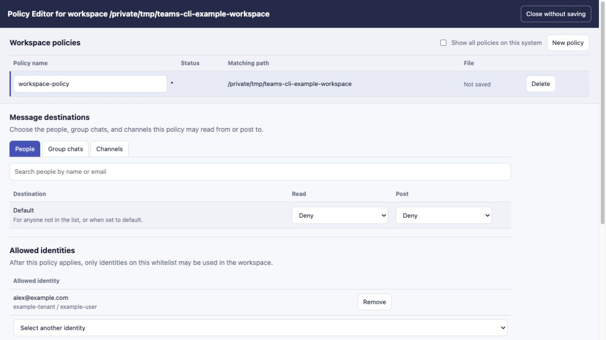
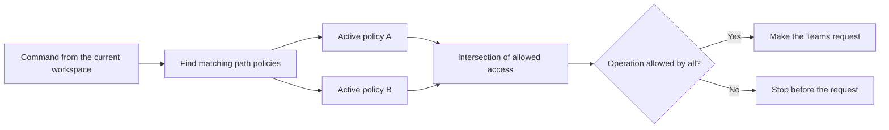

# Workspace policies

Policies are optional YAML files that help keep agent-assisted Teams work within the intended identity, conversations, and capabilities for a workspace. They can limit message reads, posts, and raw-token export when commands are run through `teams-cli`.

Policies are cooperative safeguards, not a hard security boundary. They are most useful for preventing accidents such as reading the wrong chat, posting to the wrong channel, switching identities, or exporting a bearer token unnecessarily.

## Start with the policy editor

Run the editor from the workspace the policy should cover:

```bash
cd /path/to/workspace
teams-cli policy edit --open
```

The editor creates a restrictive draft for the current path and its descendants. Select the people, group chats, and channels that may be read or posted to, verify the allowed identity, and leave raw-token export disabled unless it is genuinely required.



Use **Save** to keep the policy inactive while testing it, or **Save and activate** when the selections are ready to enforce. New policies deny message destinations by default, but remain in audit mode until activated.

The editor discovers identity and destination metadata for selection. It cannot read message contents, start chats, or send messages. It runs only for the current CLI invocation; there is no daemon. The printed URL contains a one-time bootstrap token, binds to loopback outside containers, and stops after Save and activate, Close, Ctrl-C, or the final browser connection closes.

In a container the editor binds to all interfaces so an explicitly published port can reach it. Publish the port only onto a trusted localhost interface.

## What happens without a policy

An authenticated command remains allowed when no active policy applies. In an interactive terminal, the CLI offers to open the editor. In a non-interactive session, it prints the command needed to configure least-privilege access.

An inactive policy is evaluated in audit mode:

- The CLI warns that the policy is not enforcing restrictions.
- A decision that would be denied produces a warning.
- The operation remains allowed unless another applicable active policy denies it.

This lets you observe representative commands before activation without blocking work.

## How policies match a workspace

The policy subject is the canonical absolute path from which the CLI is invoked. Symlinks are resolved before matching. This path is a useful convention for associating an agent workspace with intended access; it is not an external standard or a strong process identity.

Each policy contains one or more absolute path patterns using Node.js glob syntax:

```yaml
subject:
  paths:
    - /Users/me/Workspaces/project
    - /Users/me/Workspaces/project/**
    - /Users/me/Workspaces/client-*/**
```

Paths within one policy are alternatives. Matching any path makes that policy applicable. When several active policies apply, every one must allow the identity and operation. Adding another active policy can therefore preserve or narrow access, never widen it.



The CLI validates every `.yaml` file in `~/.teams-cli/policies/` before matching. An unreadable, malformed, misnamed, or unsupported policy—or an active policy writable by group or other users—puts authenticated operations into fail-safe mode. Files without a `.yaml` extension are ignored.

## Policy file format

Create a named restrictive draft without the browser editor with:

```bash
teams-cli policy init project-agent
```

Without explicit subjects, initialization includes the current canonical path and its descendants. Repeat `--subject` for custom absolute patterns:

```bash
teams-cli policy init client-projects \
  --subject '/Users/me/Workspaces/client-a/**' \
  --subject '/Users/me/Workspaces/client-b/**'
```

Quote glob patterns so the shell does not expand them. A generated policy uses the current schema:

```yaml
version: 1
name: project-agent
active: false
subject:
  paths:
    - /Users/me/Workspaces/project
    - /Users/me/Workspaces/project/**
identity:
  allowed:
    - tenantId: tenant-id
      userId: user-id
allow:
  people: {}
  chats: {}
  channels: {}
  rawTokenExport: false
deny:
  people: {}
  chats: {}
  channels: {}
```

Each destination maps to one or both independent actions:

```yaml
allow:
  people:
    user-object-id: [read]
  chats:
    "19:example-chat@thread.v2": [read]
    "*": [read]
  channels:
    "19:example-channel@thread.tacv2": [read, post]
  rawTokenExport: false
deny:
  people: {}
  chats:
    "19:sensitive-chat@thread.v2": [read, post]
  channels: {}
```

- `read` permits `message list` and `message get`.
- `post` permits `message send`; it does not imply `read`.
- People, group chats, and channels are separate destination types. A one-to-one person entry does not authorize a group chat or channel with the same identifier.
- The `"*"` destination is supported only in `allow`. Exact denials override exact and wildcard allowances within the same policy.
- Discovery metadata such as chat names, participants, teams, and channels is not constrained in this release.
- Decoded token claims do not require `rawTokenExport`; complete bearer tokens do.

## Inspect and test a draft

Inspect configured or applicable policies:

```bash
teams-cli policy list
teams-cli policy show project-agent
teams-cli policy show
teams-cli policy show --path /absolute/path/to/check
```

Check representative decisions while a policy is inactive. Warnings show what audit mode would deny:

```bash
teams-cli policy check read --chat CHAT_ID
teams-cli policy check read --channel CHANNEL_ID
teams-cli policy check send --chat CHAT_ID
teams-cli policy check send --channel CHANNEL_ID
teams-cli policy check raw-tokens
```

The CLI evaluates active policy again immediately before each message request. A successful check is a preview rather than a promise that a later operation will still be allowed.

## Activate and protect a policy

Activate enforcement by name:

```bash
teams-cli policy activate project-agent
```

On POSIX systems, activation prints an exact optional protection command such as:

```bash
chmod 400 -- '/Users/me/.teams-cli/policies/project-agent.yaml'
```

Activation and filesystem protection are separate:

- `active: true` makes `teams-cli` enforce the policy.
- Owner-read-only permissions reduce accidental same-user modification.
- An active owner-writable policy is enforced but produces a warning.
- An active policy or policy directory writable by group or other users fails closed.
- On Windows, use an administrator-managed read-only ACL for comparable protection.

Read-only permissions are defense in depth, not an immutable lock. A process with sufficient owner or administrator privileges can still replace the file.

## Edit or deactivate a policy manually

Policy files are ordinary YAML and may be edited with a text editor. The browser editor is the convenient path for creating and refining drafts, but it intentionally cannot save an active or filesystem-read-only policy in place. It can export the revised YAML or an atomic apply command instead.

There is deliberately no `policy deactivate` command. To deactivate an active policy, you must edit its file manually:

1. Find the exact file path:

   ```bash
   teams-cli policy show project-agent
   ```

2. If the file was made owner-read-only on POSIX, make that one file writable:

   ```bash
   chmod u+w '/exact/policy/path.yaml'
   ```

3. Open the file in your preferred editor and change only:

   ```yaml
   active: false
   ```

4. Review the result and test representative operations. The inactive policy now audits and warns without enforcing:

   ```bash
   teams-cli policy show project-agent
   teams-cli policy check read --chat CHAT_ID
   teams-cli policy check send --channel CHANNEL_ID
   ```

5. After revising the allowlists, activate it again when ready:

   ```bash
   teams-cli policy activate project-agent
   ```

If permissions are controlled by a read-only mount, sandbox, separate operating-system identity, or administrator ACL, change them through that external layer first.

The CLI also has no policy removal command. To remove a policy, find its exact path and delete only that file. Removing the last applicable active policy may leave the workspace unrestricted, so confirm the result with `policy show` and `policy check`.

## Security boundary

Active policies are enforced when an operation goes through `teams-cli`. They primarily reduce accidental message disclosure, posts to unintended destinations, identity use, and token export.

They do not constrain another HTTP client, a bearer token that has already been exported, or a sufficiently privileged local process that changes the policy store. Strong non-bypassable enforcement requires controls outside the agent process, such as a separate operating-system identity, a read-only container mount, restricted network egress, or server-side Teams permissions. See the [security model](../build/security-model.md) for the complete design boundary.
